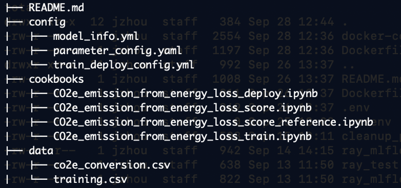

## Turning Energy Loss into CO2 Equalevent Emissions

This guide explains how to calculate the CO2 equivalent emissions from the amount of energy usage or lost due to inefficiency, starting with the example of energy loss from an electrical distribution transformer. The method can be used for all kinds of equipment to determine how much CO2 equivalent emissions they effectively put into the environment.

For this example, we first calculate the distribution energy due to load and/or unload losses, then, based on the location of the electrical transformer specified with the US location ZIP code, calculate the emissions.  Inside the calculation, we use the information published by the [US EPA](https://www.epa.gov/egrid/power-profiler#/) to determine how much CO2 emission this represents.

Knowing the CO2 emissions is helpful for power companies and companies that own industrial assets like pumps and compressors to help understand the environmental impact of the business, meet any current or future compliance standards, and improve business decision-making.


## Service Usage Process Flow

Follow the steps outlined below to use the service for a specific end-user:

1. **Satisfying the Prerequisites**
   - Ensure all the necessary conditions are met before proceeding to the next step.

2. **Prepare a Configuration File**
   - Set up a file that contains all the necessary parameters and settings for the service.

3. **Prepare a Training Dataset**
   - Gather and organize the data required for training the model.

4. **Use the CO2e API to Train to Generate the CO2e Model**
   - Utilize the CO2e API to train a model using the prepared dataset.

5. **Deploy and Generate**
   - After the model is generated, deploy it to start utilizing the service.

6. **Using the Model to Score New Dataset**
   - Use the generated model to analyze and score a new dataset.


## 1. Prerequisites

1. The accelerator is accessible through the IBM Maximo Early Beta Program. For more information, visit the following link: [here](https://epwt-www.mybluemix.net/software/support/trial/cst/welcomepage.wss?siteId=1594&tabId=4363&w=1)

2. To gain access, you will need an IBM ID. If you do not have one, you can create an IBM ID by following the link: [here](https://www.ibm.com/account/us-en/):

3. Access to a Maximo Application Suite (early beta) environment. You can find instructions on getting setup [here](http://maximo-lab.monitordemo4.ibmmam.com/apm_8.9/get_started/)

4. Access to Watson Studio to run the cookbooks. You can find instructions to set up Watson Studio [here](http://maximo-lab.monitordemo4.ibmmam.com/apm_8.9/setup_watson_studio/)


## 2. Repository structure




## 3. Prepare a Configuration File

Here's a breakdown of the example configuration file below and how it is used:

properties: This is the root key

unit: This key specifies the unit of measurement for energy consumption, with valid values being either 'kwh' (kilowatt-hours) or 'wh' (watt-hours). 

conversion_factor: This key denotes a factor that can be used to convert between 'kwh' and 'wh'. A value of 1000.0 suggests that the value is in 'kwh' (since 1 kwh = 1000 wh), whereas a value of 1.0 would mean the value is already in 'wh'.

default_emissions_rate: This key provides a default rate of CO2 emissions in terms of grams per watt-hour. It is a national emissions rate used in the absence of a zip code specific emissions rate.

energy_loss_column: This key refers the column name in a dataset or database table where energy loss values are stored. 

location_zip_column: This key refers to the column name that contains the code ZIP code.

```
properties:
    unit: kwh #must be kwh or wh
    conversion_factor: 1000.0 #Has a value of 1000.0 for kwh and 1.0 for wh
    default_emissions_rate: 0.38873727934503005 # (gram/wh)
    energy_loss_column: energy_loss
    location_zip_column: location_zip
```


### Usage Instructions

For you to effectively use this configuration file, they would need to:

1. Choose the appropriate unit of measurement for energy (kwh or wh) and set the `unit` and `conversion_factor` properties accordingly.
2. (Optional) Update the `default_emissions_rate` based on the latest data or specific requirements of their analysis.
3. Ensure their dataset contains columns named `energy_loss` and `location_zip` with appropriate data to be used in calculations/analyses based on this configuration file.


## 4. Prepare data

1. The default approach is to estimate CO2 equivalent emissions from the conversion factor deduced from the [EPA website](https://www.epa.gov/egrid/power-profiler#/) for the power profile.   As an end-user,  you need to prepare a dataset containing a 'energy_loss' column and a 'location_zip' column and a configuration file.

* An energy loss estimation - The energy loss estimates the energy losses of the substation transformer or any other asset.  Overall energy output data may also be used to calculate overall CO2 emissions.

* Location Zip code - The location_zip is the ZIP code for the electrical transformer or relevant asset.

Example dataset:

| energy_loss | location_zip |
| ----------- | ------------ |
| 5.38E-07    | 85282        |
| 9.44E-07    | 85282        |
| 9.35E-07    | 85282        |
| 1.01E-06    | 85282        |
| 1.05E-06    | 85282        |


1. Ensure that the features are in that order. See [data folder](data/training.csv) for example datasets.
2. Prepare a dataset for scoring, see [data folder](data/monitor_scoring.csv) for example datasets.
3. Update a [config](config/parameter_config.yaml) file to reflect domain knowledge.


## 5. Model Training
---

1.  Update the file name of the yaml files prepared in [co2 emission training](cookbooks/CO2e_emission_from_energy_loss_train.ipynb) notebook
2.  Run [co2 emission train](cookbooks/CO2e_emission_from_energy_loss_train.ipynb) notebook, which calls the model factory service to run training on CO2 emission recipe for electrical transformer


## 6. Deployment
1. Ensure that the [co2 emission train](cookbooks/CO2e_emission_from_energy_loss_train.ipynb) notebook has completed running with "FINISHED" status
2. Run the [co2 emission deploy](cookbooks/CO2e_emission_from_energy_loss_deploy.ipynb) notebook to deploy WML models from the saved artifacts after the train run. You do not need to change any values.

## 7. Scoring
1. Ensure that the [co2 emission train](cookbooks/CO2e_emission_from_energy_loss_train.ipynb) notebook has completed running with "FINISHED" status
2. Ensure that the [co2 emission deploy](cookbooks/CO2e_emission_from_energy_loss_deploy.ipynb) notebook has completed running with "FINISHED" status
3. Make the necessary changes in the evaluation data in [co2 emission score](cookbooks/CO2e_emission_from_energy_loss_score.ipynb) notebook
4. Run the [co2 emission score](cookbooks/CO2e_emission_from_energy_loss_score.ipynb) notebook to evaluate scoring on the data file to return values.

## 8. Output from Scoring


