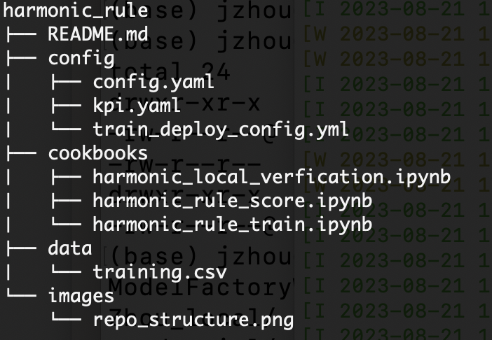

# Rule-Based Anomaly Detection

The electrical transformer rule-based anomaly detection uses sensors or other deduced metrics (such as KPIs) with set maximum and minimum threshold points. This method offers a straightforward and effective means of monitoring sensor metrics or KPIs (Key Performance Indicators) over a designated period. It identifies anomalies by comparing observed values against predefined thresholds. If observed values surpass these thresholds, the system generates a tag (or indicator) for that timestamp. Additional rules tally these indicators over a specified timeframe for various metrics or KPIs to initiate an alert or anomaly. These supplementary rules help prevent an overload of anomalies in the system.

This rule-based anomaly detection method is easy to implement and understand, making it a favored choice for monitoring system performance and early detection of potential issues. However, it does have its limitations since it depends on predefined thresholds. It might not recognize more intricate or subtle anomalies that necessitate advanced statistical or machine-learning techniques.

We use voltage harmonics and oil temperature indicators as examples of rule-based anomaly detection in the context of electrical transformers, which makes sense for several reasons:

1. Relevance to Electrical Transformers:

Voltage Harmonics: Transformers are expected to handle sinusoidal voltages. However, due to non-linear loads like electronic devices, variable speed drives, or fluorescent lighting systems, harmonics can be introduced into the system. Excessive harmonics can lead to increased transformer losses, overheating, and reduced life expectancy.

Oil Temperature: Transformers are cooled using oil. The temperature of this oil can indicate the health and operation status of the transformer. Elevated oil temperatures may suggest issues like overloading or deteriorating insulation.

2. Clear Thresholds:

Rule-based anomaly detection is most effective when there are clear and well-understood thresholds. Voltage Harmonics has a 0.05 limit as per IEEE standards and transformers have defined oil temperature limits (although they vary depending on a vareity of factors.)

3. Criticality:

Both voltage harmonics and oil temperature are critical parameters for the operation of transformers. Anomalies in these metrics can suggest potential failures or reduced efficiency. Early detection of anomalies can prevent more serious issues or outages.


## Repository structure



## Prepare Configuration 


The configuration file is to help to define how the alert/alarm is going to be generated.

The rule-based anomaly recipe is highly versatile and can be configured for a wide variety of different data inputs and multiple options for outputs and how outputs are displayed. The configuration for harmonic distortion rule-based anomaly detection is given below as an example case. Each parameter is discussed in the text below.  It explains how to map the thresholds to sensors or deduced metrics.


```
rule: 
  unit: percentage
  limits:
    upper_limit: 5.0
sensors:
  - name: "THDVL1"
    ratio: 1.0
  - name: "THDVL2"
    ratio: 1.0
  - name: "THDVL3"
    ratio: 1.0
timeframes:
  timestamp_col_name: "datetime"
  window_size: "24H"
  cumulative_method: percentage   # the allowed value is either percentage or count
  cumulative_threshold: 0.03   # 3% of total monitored values above the IEEE presscribed threhold
list_of_outputs:
  - anomaly
  - anomaly_sum
  - anomaly_sum_flag
```

1. 'rule' is a labeling string for the rule based anomyaly task you are performing. It is used for display purposes but does not effect the functionality of the recipe. In the example above the parameter value is "Harmonic Distortion" since we are configuring the recipe for harmonic distortion anomaly detection.
- 'unit' gives the unit of measurement of the input data.
- 'limits' must contain at least one of an 'upper_limit' and 'lower_limit' which define threshold that will be used to flag the anomalies in the dataset.
2. 'sensors' parameter can have one more entries formatted as shown above. 'name' represents the name of a column in the input dataset and must match the data column name exactly for the recipe to work properly. The 'scale' parameter will be multipled by the values of the column and can be used to account for unit changes. In this case unit adjustments are not needed so the 'scale' parameter is set to one.
3. 'timeframes' consists of a number of parameters which are used to determine the timestamp column, the number of intervals, the method of anomaly aggregation measurement, and the strings that will be displayed if the string output is chosen. Working through these parameters one by one:
- 'timestamp_col_name' gives the name of the timestamp column in the input data.
- 'time_unit' represents the time interval of the dataset.
- 'time interval' is the number of time units the window size of the rolling window of anomaly aggregation. In the example case we 96 time intervals of 15 minutes which is 24 hours.
- 'method' refers to whether the anomaly_sum_flag measures the accumulated anomalies for flagging by a 'percentage' or a 'count.' Only 'percentage' or 'count' are valid inputs to this parameter.
-  'value' determines the count or percentage of anomalies required in the rolling window before the 'anomaly_sum_flag' is raised. 
-  'anomaly_display_string' gives the string that will be displayed for the anomaly flag if 'output_as_string' is set to true.
-  'anomaly_frequency_display_string' gives the string displayed for the anomaly_sum_flag if 'output_as_string' is set to true. 

```
    A. 'timestamp_col_name' gives the name of the timestamp column in the input data.
    B. 'time_unit' represents the time interval of the dataset.
    C. 'time interval' is the number of time units the window size of the rolling window of anomaly aggregation. In the example case we 96 time intervals of 15 minutes which is 24 hours.
    D. 'method' refers to whether the anomaly_sum_flag measures the accumulated anomalies for flagging by a 'percentage' or a 'count.' Only 'percentage' or 'count' are valid inputs to this parameter.
    E. 'value' determines the count or percentage of anomalies required in the rolling window before the 'anomaly_sum_flag' is raised. 
    F. 'anomaly_display_string' gives the string that will be displayed for the anomaly flag if 'output_as_string' is set to true.
    G. 'anomaly_frequency_display_string' gives the string displayed for the anomaly_sum_flag if 'output_as_string' is set to true. 
```
4. 'output_as_string' is a boolean parameter which is set to true if the desired display is the strings mentioned above or false if '1' and '0' are the prefered display for the anomaly_sum and anomaly_sum_flag.
5. 'list_of_outputs' determines the output of the rule based anomaly recipe and can consist of one or more of: 'anomaly', 'anomaly_sum', and 'anomaly_sum_flag.'

### Usage Instructions

For you to effectively use this configuration file, they would need to:

1. Choose the appropriate parameters in the configuration file above for your use case and desired outputs.
3. Ensure their dataset contains columns which match the 'sensors' 'name' entries and contains the relevent data for flagging anomalies.


## Prepare data

Time Series Anomaly Rule Data must be a .csv and contain the columns of data that the user wishes to use the rule_based_anomaly recipe on.

An example dataset extracted from [kaggle](https://www.kaggle.com/datasets/sreshta140/ai-transformer-monitoring) is shown below using voltage harmonics and oil temperature indicator as the relevant KPI:


| datetime            | OTI  | THDVL1 | THDVL2 | THDVL3 |
| ------------------- | ---- | ------ | ------ | ------ |
| 2020-01-26 08:00:00 | 16.0 | 1.3    | 1.3    | 1.4    |
| 2020-01-26 08:15:00 | 17.0 | 1.5    | 1.3    | 1.3    |
| 2020-01-26 08:30:00 | 17.0 | 1.3    | 1.4    | 1.4    |
| 2020-01-26 08:45:00 | 18.0 | 1.5    | 1.4    | 1.4    |
| 2020-01-26 09:00:00 | 18.0 | 1.5    | 1.5    | 1.5    |

The meaning of the columns and their units:

- OTI- Oil Temperature Indicator (unit: Celsius)
- THDVL1, THDVL2 and THDVL3 - Voltage Total Harmonic Distortion for Line 1, 2 and 3 (percentage)

1. Prepare a dataset for scoring, see [data folder](data/harmonic_training.csv) for example datasets.
2. Update the configuration_file [config](config/config.yaml) file to reflect domain knowledge and change the configuration file the needs appropriate to the user. Details about the configuration file are provided below.

## 2. Training
1.  Update the file name of the yaml files prepared in [harmonic rule training](cookbooks/harmonic_rule_train.ipynb) notebook
2.  Run [harmonic rule train](cookbooks/harmonic_rule_train.ipynb) notebook, which calls the model factory service to run training on rule based anomaly detection recipe for electrical transformer
3.  Monitor the result of the API, and save the result to a yaml file, by running the last 2 cells of the notebook

## 3. Deployment
1. Ensure that the [harmonic rule train](cookbooks/harmonic_rule_train.ipynb) notebook has completed running with "FINISHED" status
2. Run the [harmonic rule deploy](cookbooks/harmonic_rule_deploy.ipynb) notebook to deploy WML models from the saved artifacts after the train run. You do not need to change any values.

## 4. Scoring
1. Update the file name of the evaluation data in [harmonic rule score](cookbooks/harmonic_rule_score.ipynb) notebook
2. Run the [harmonic rule score](cookbooks/harmonic_rule_score.ipynb) notebook to evaluate scoring on the data file to return values.


## Examples and Explanation of anomaly, anomaly_sum, and anomaly_sum_flag

The following is an example output for rules based anomaly detection for voltage harmonics.

1. Rows with 'THDVL1' values greater than 5.0 have an anomaly_flag set to 1. For example, the values 5.8, 5.1, 5.9, and 5.6 have this flag set.

2. 'anomaly_sum' is a rolling count of these anomalies. So, for the 3rd entry (with value 5.8), there's 1 anomaly. For the 5th entry (with value 5.1), the sum becomes two, considering the previous anomaly. This continues for the entire table.

3. 'anomaly_sum_flag' is raised (set to 1) when the anomaly_sum meets or exceeds the cumulative threshold, which in this case seems to be around 3 or more anomalies within a certain window (not entirely clear from this short table, but it's based on the cumulative method and threshold set in the configuration). This is clear in rows 7, 8, and 9 where the anomaly_sum_flag is set to 1.

In summary, this table gives a snapshot of harmonic distortion values for the sensor THDVL1 and flags anomalies when the reading exceeds 5.0%. It also provides a rolling sum of these anomalies and raises another flag (anomaly_sum_flag) when the sum exceeds a certain threshold in a given timeframe. The three recipe outputs demonstrated in this particular use case can be applied to any input dataset depending on the configuration file settings.

  | THDVL1 | anomaly_flag | anomaly_sum | anomaly_sum_flag |
  |-------|--------------|-------------|------------------|
  | 4.3   | 0            | 0           | 0                |
  | 4.6   | 0            | 0           | 0                |
  | 5.8   | 1            | 1           | 0                |
  | 3.7   | 0            | 1           | 0                |
  | 5.1   | 1            | 2           | 0                |
  | 4.1   | 0            | 2           | 0                |
  | 5.9   | 1            | 3           | 1                |
  | 4.4   | 0            | 3           | 1                |
  | 5.6   | 1            | 4           | 1                |


